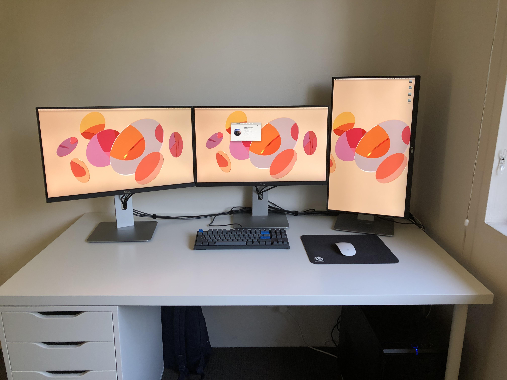
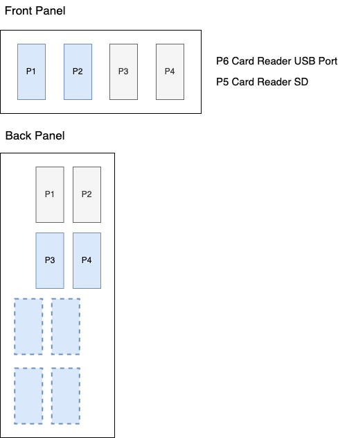

# GA-Z77X-D3H Monterey Hackintosh 🍎

## ⚠️⚠️ Warning: Abandonware Ahead ⚠️⚠️

This project is no longer actively maintained. In January 2022 I have upgraded from my Z77 Ivy Bridge Hackintosh to an Z590 Rocket Lake Hackintosh. See more at [https://github.com/nickw444/opencore-efi-z590](https://github.com/nickw444/opencore-efi-z590).

## 🖥 Hardware Details
| Component | Details  |
|---|---|
|Mobo| GA-Z77X-D3H|
|GFX| GV-RX580GAMING-8GD|
| | Intel HD4000 |
| Audio | Via VT2021 |
| Network | Atheros AR8151 v2.0 |
|  | BCM943602CS (Identified as BCM94360CD) AirPort Extreme  (0x14E4, 0x133) |
| Bluetooth | BCM943602CS |
| USB | Intel USB2/3 7 series chipset |
|  | VIA VL800 (lower 4 ports on rear), **Unsupported** |




## ⚠️⚠️ Warning ⚠️⚠️

This is the EFI configuration for my **very specific** combination of hardware. It comes with **absolutely no guarantees** whatsoever.

It is extremely unlikely that this configuration will even work for you, even if your hardware combination is very similar. Please use it as a learning/reference resource only.


### EFI, in git?

For my sanity, I have revisioned my `/Volumes/EFI/EFI` directory under git. This allows me to easily diff any changes I have made and easily roll back at any point in time.

However, typically the `EFI` partition is a tiny, around 200MB in size. This does not work well when there is a `.git` directory living inside, as every revision of binary files will be stored in here, easily filling up the space.

As a workaround, [it is possible](https://stackoverflow.com/a/40561395/913363) to place the `.git` directory across different mount-points by instead creating a file, `.git` and pointing it to the real `.git` location with the following directive:

```
gitdir: /Users/nickw/repos/opencore-efi/.git
```

### Secret Management

With this repository being publicly shared on GitHub, there are going to be things I do not wish to share, such as `SystemUUID`, `SystemSerialNumber`, and `MLB`.

I have implemented a simple shell script, [`oc-private.sh`](resources/bin/oc-private.sh) to implement git clean and smudge filters to transparently remove and re-add secrets when staging and unstaging files.

The hooks can be installed by running

```sh
./resources/bin/oc-private.sh install
```

## ❓ Guides

* https://dortania.github.io/OpenCore-Desktop-Guide/
* https://usb-map.gitbook.io/project/
* https://github.com/corpnewt/USBMap

## ✅ Past Success for similar board

* https://www.tonymacx86.com/threads/robbishs-8yr-old-atx-ivybridge-hackintosh-ga-z77-ds3h-i5-3570k-hd-4000-opencore-macos-big-sur.311037/
* https://www.reddit.com/r/hackintosh/comments/7cuccm/gaz77xd3h_high_sierra_success/
* https://www.reddit.com/r/hackintosh/comments/g3b9mn/gaz77xd3h_catalina_success/
* https://www.tonymacx86.com/threads/near-perfect-high-sierra-setup-on-z77x-ud5h-ivy-bridge-i5-rx-560.252663/

## 💤 Sleep/Wake

After installing Monterey, sleep was completely broken, even after re-mapping USB ports. I narrowed this down to being due to the iGPU (HD4000) being enabled, but unsupported by Monterey. This can be solved by either:

* Disabling iGPU in the BIOS
* Disabling iGPU via PCI injection in OpenCore configuration:

```xml
<key>PciRoot(0x0)/Pci(0x2,0x0)</key>
<dict>
        <key>disable-gpu</key>
        <data>AQAAAA==</data>
</dict>
```

* Prepare `pmset` params ([source](https://dortania.github.io/OpenCore-Post-Install/universal/sleep.html#preparations)):
   * `sudo pmset autopoweroff 0`
   * `sudo pmset powernap 0`
   * `sudo pmset standby 0`
   * `sudo pmset proximitywake 0`
   * `sudo pmset tcpkeepalive 0`


**Troubleshooting**

* Wake causes: https://www.cnet.com/news/how-to-find-system-wake-causes-in-os-x/
* syslog | grep Wake
* log show --style syslog | fgrep "Wake reason"
* sudo pmset -g log
* Turns out random wakes during the night was due to power nap. Disabled power nap in system preferences and appears to have solved the issue
* Serial Port must be disabled in the BIOS [Source](https://www.insanelymac.com/forum/topic/339369-wake-issues-since-catalina/?tab=comments#comment-2691528), without this a KP when resuming from sleep will occur.
* Even with serial port disabled, after longer periods of sleep, a KP is experienced during wake. It appears the boot arg `agdpmod=vit9696` has solved this ([source](https://www.reddit.com/r/hackintosh/comments/d9j622/catalina_hackintosh_working_fine_buuuut_two/f1ifpmy/))

```
jq -r 'map(.timestamp | match("\\d+\\-\\d+\\-\\d+\\s+\\d+:\\d+") | .string ) | .[]' | uniq

log show --start "2019-05-02 12:00:00" --end "2019-05-02 18:00:00"  --style json | jq -r 'map(.timestamp | match("\\d+\\-\\d+\\-\\d+\\s+\\d+:\\d+") | .string ) | .[]' | uniq
```

## ✔️ Post Setup Checks

Things to check post-setup/upgrade

* Check TRIM is enabled on all drives
* Ensure CPU power management is working correctly
* Check USB Mapping is correct in IOReg/IORegistryExplorer

## 🥾 Bootloader

OpenCore used as boot loader (Clover replacement). Bootloader config is revisioned via git: https://gitlab.com/nickw444/opencore-efi (this repo)

## 🖥 Hardware

### BIOS Settings

Saved configurations can be found in [resources/bios-config/](resources/bios-config/)

#### Diffable Settings:

* Defaults as base

##### BIOS Features
* Fast Boot: Disabled
* limit CPUID Max: Disabled
* Execute Disable Bit: Enabled
* Intel Virtualization Technology Enabled
* OS Type: Windows 8 WHQL
* CSM Support: Always
    * UEFI Only
    * LAN PXE Boot Option ROM: Disabled
    * Storage Boot Option Control: Disabled
* Other PCI Device ROM priority: UEFI OpROM
* Network Stack: Disabled
* Secure Boot: Enabled
* Secure Boot Mode: Standard

##### Peripherals

* Sata Controllers: Enabled
* Sata Mode Selection: AHCI
* XHCI Pre Boot Driver: Enabled
* xHCI Mode: AUTO
    * HS Port 1 Switchable: Enabled
    * HS Port 2 Switchable: Enabled
    * HS Port 3 Switchable: Enabled
    * HS Port 4 Switchable: Enabled
    * xHCI Streams: Enabled
* USB2.0 Controller: Enabled
* Audio Controller: Enabled
* Init Display First: Auto
* Internal Graphics: Enabled
* Internal Graphics Memory Size: 32M
* DVMT Total Memory Size: MAX
* Intel Rapid Start Technology: Disabled
* Legacy USB Support: Enabled
* XHCI Hand-off: Enabled
* EHCI Hand-off Disabled
* Port 60/64 Emulation: Disabled
* USB Storage Devices:
    * 1.00: Auto
    * Onboard USB3 Controller #1: Enabled
    * Onboard LAN Controller #1: Enabled
    * PCIE Slot Configuration: AUTO
* SuperIO Configuration
    * Serial Port A: Disabled
* Intel SMart Connect Technology:
    * ISCT Configuration: Disabled
* Marvel ATA Controller Configuration
    * GSATA Controller: AHCI Mode

##### Power Management

* Resume by Alarm: Disabled
* ERP: Disabled
* High Precision Event Timer: Enabled
* Soft off by PWR BUTTON: Instanced Off
* Internal Graphics Standby Mode: Enabled
* Internal Graphics Deep Standby Mode: Enabled
* AC Back: Always Off
* Power On By Keyboard: Disabled
* Power On By Mouse: Disabled


### 🔊 Audio

Works OOB with [AppleALC](https://github.com/acidanthera/AppleALC/) using `inject=5`

### ⌨️ USB

USBInjectAll (UIA) was previously used to inject ports using custom SSDT. However it is now possible to inject ports using a simple injector kext instead of using UIA.

The injector kext can be found in [OC/Kexts/USBMap.kext](OC/Kexts/USBMap.kext). This injector kext was created with [USBMap](https://github.com/corpnewt/USBMap) via [this guide](https://dortania.github.io/OpenCore-Post-Install/usb/intel-mapping/intel.html).

#### Quirks:

* The GA-Z77X-D3H is [notorious](https://forums.tomshardware.com/threads/gigabyte-z77-d3h-usb-3-0-external-hdd-detection-issue.394328/) for having [power delivery](https://www.overclock.net/forum/6-intel-motherboards/1314782-front-usb-3-0-fails-gb-ga-z77x-d3h.html) issues on the internal front-panel header. After a fair bit of research this is found to be a common issue and is the reason for random USB3 disconnection during use. This issue is reproducable in both Windows and OSX
* The 7-series USB chipset has top level hubs on the `EHC{1,2}` busses. These need to be injected with a special `AppleUSB20InternalIntelHub` record, as opposed to the top level controllers registered with `AppleUSBEHCIPCI`.
* XHCI/EHCI routing on this board is very weird. Regardless of selected BIOS settings for XHCI/EHCI, both rear panel USB3 ports are routed via the EHC controller when a USB2 device is connected. This is observed in both Windows and MacOS.
* Due to the above routing weirdness, and the requirement for the Bluetooth controller to sit on the XHC bus as an "internal port", it's necessary for one of the front panel USB3 ports to be re-purposed as an internal port.

Other Resources:

* [(deleted) USB guide from dortania](https://github.com/dortania/OpenCore-Desktop-Guide/blob/ea34ae5bc28f5304d28c864d547505602f18de5a/post-install/usb.md#intel-usb-mapping)
* [USBMap guide](https://github.com/corpnewt/USBMap)

#### Port Mapping

**PCI/ACPI Map**

```
├── EHC1 (Bus servicing internal USB2 headers)
│   └── PRT1 (Internal Hub, location 0x1d100000)
│       ├── PRT5 (Front Panel P3)
│       ├── PRT6 (Front Panel P4)
│       ├── PRT7 (Front Panel P5 - Card Reader)
│       └── PRT8 (Front Panel P6 - Card Reader USB)
├── EHC2 (Bus servicing back panel USB2)
│   └── PRT1 (Internal Hub, location 0x1a100000)
│       ├── PRT3 (Back Panel P4)
│       ├── PRT4 (Back Panel P3)
│       ├── PRT5 (Back Panel P2)
│       └── PRT6 (Back Panel P1)
└── XHC
    ├── HS01 (Front Panel P1 USB2 - Spliced internally, for BT Controller - see below)
    ├── HS02 (Front Panel P2 USB2)
    ├── SS01 (Front Panel P1 USB3)
    ├── SS02 (Front Panel P2 USB3)
    ├── SS03 (Back Panel P3 USB3)
    └── SS04 (Back Panel P4 USB3)
```



The above listed ports/locations are found by temporarily using USBInjectAll (with `EHCX` -> `EH0X` remap) to inject all ports to find their location IDs. These IDs can then be worked into the aformentioned injector kext.


### 🕸 Ethernet

Card is Atheros AR8151 v2.0. Compiled my own version of AtherosL1cEthernet.kext against High Sierra frameworks. Works in Mojave and Monterey.

* https://github.com/al3xtjames/AtherosL1cEthernet
* https://www.tonymacx86.com/threads/i-need-kext-for-ethernet-with-mojave-with-ga-z77-ds3h.270126/
* https://www.tonymacx86.com/threads/atherosl1cethernet-tweaked-for-high-sierra.236867/

### 🖥 Intel GPU HD4000

HD4000 is no longer supported in Monterey, and thus must be disabled, else risk problems with sleep. This can be done by:

* Disabling iGPU in the BIOS
* Disabling iGPU via PCI injection in OpenCore configuration:

```xml
<key>PciRoot(0x0)/Pci(0x2,0x0)</key>
<dict>
        <key>disable-gpu</key>
        <data>AQAAAA==</data>
</dict>
```

**Before Monterey**
Current `ig-platform-id`: `0x01620007`. iGPU is being used as secondary with dGPU as primary.

**Known IDs**

| AAPL,ig-platform-id | Memory (MB) | Pipes | Ports  | Comment | Notes From Testing |
| --- | --- | --- | --- | --- | --- |
| `0x01660000` | 96 | 3 | 4 |  | |
| `0x01660001` | 96 | 3 | 4 |  | |
| `0x01660002` | 64 | 3 | 1 | No DVI | |
| `0x01660003` | 64 | 2 | 2 |  | |
| `0x01660004` | 32 | 3 | 1 | No DVI | |
| `0x01620005` | 32 | 2 | 3 |  | |
| `0x01620006` | 0  | 0 | 0 | No display | Panic on wake from sleep without `agdpmod=vit9696` |
| **`0x01620007`** | 0  | 0 | 0 | No display | Panic on wake from sleep without `agdpmod=vit9696` |
| `0x01660008` | 64 | 3 | 3 |  | |
| `0x01660009` | 64 | 3 | 3 |  | |
| `0x0166000a` | 32 | 2 | 3 |  | |
| `0x0166000b` | 32 | 2 | 3 |  | |


**Official Docs**

* https://github.com/acidanthera/WhateverGreen/blob/master/Manual/FAQ.IntelHD.en.md


**Other Docs**

* https://gist.github.com/al3xtjames/c46e368c3227cdc58e900f7117f34571
* http://blog.stuffedcow.net/2012/07/intel-hd4000-qeci-acceleration/
* https://www.reddit.com/r/hackintosh/comments/7m8uah/enabling_igpu_gpu/
* https://www.tonymacx86.com/threads/dual-graphics-headless-igpu-amd-hardware-acceleration-on-mojave.267554/

### 🔌 CPU Power Management

* ssdtprGen.sh https://github.com/Piker-Alpha/ssdtPRGen.sh
* Confirm with https://github.com/Piker-Alpha/AppleIntelInfo
* https://www.insanelymac.com/forum/topic/304369-how-to-check-your-states-%E2%80%93-using-aicpminfo-msrdumper-or-appleintelinfo/


### 📶 Bluetooth / WiFi w/ Broadcom Card

BCM943602CS: 802.11ac 3x3, (1.3Gbps / 5GHz) + Bluetooth 4.1. The module will be applied in MacBook Pro computers (2015)

* BCM43602 14e4:43ba supported in 3.17+ (brcmfmac)
* BCM43602 14e4:43bb 2.4GHz device, supported in 3.19+
* BCM43602 14e4:43bc 5GHz device, supported in 3.19+

Bluetooth USB connection must be connected to XHC bus and marked as internal (DSDT type 255), otherwise this will cause random wake as soon as machine goes to sleep. Recall all USB ports on the back panel are routed via EH02 via a hub, so we cannot use that, and instead must splice the internal USB ([source](https://github.com/al3xtjames/Gigabyte-GA-Z77X-macOS-Install/issues/65#issuecomment-312686694))

> What worked for me in the same fenvi is making sure that the connector type for the internal usb header is set to internal port. I used fbpatcher to do it. [1](https://www.reddit.com/r/hackintosh/comments/ayou5v/fenvi_fvt919_bluetooth_not_working/ei2nymc/)

Previously used a USB3 20 pin splitter to splice, but this caused issue with USB detection from the FP ports. Instead a splice was made directly in the cable from the case. May need to "unsplice" if a replacement mobo has better internal USB support.

**Bluetooth Firmware Issues**

This didn't seem necessary for getting BT support for Catalina, however I recall that once the firmware is loaded once the issue goes away. The issue may re-appear when returning back from Windows (which clobbers the firmware), and therefore BrcmPatchRAM might need to be re-introduced.

Add device ID so the firmware is loaded at boot ([Source](https://github.com/the-darkvoid/BrcmPatchRAM/issues/35)):

```xml
        <key>0a5c_21ff</key>
        <dict>
            <key>CFBundleIdentifier</key>
            <string>com.no-one.BrcmPatchRAM2</string>
            <key>DisplayName</key>
            <string>Broadcom BCM20702 Bluetooth 4.0 +HS USB Device</string>
            <key>FirmwareKey</key>
            <string>BCM20702A1_001.002.014.1443.1463_v5559</string>
            <key>IOClass</key>
            <string>BrcmPatchRAM2</string>
            <key>IOMatchCategory</key>
            <string>BrcmPatchRAM2</string>
            <key>IOProviderClass</key>
            <string>IOUSBHostDevice</string>
            <key>idProduct</key>
            <integer>8703</integer>
            <key>idVendor</key>
            <integer>2652</integer>
        </dict>
```

> The thing I'd check is the Vendor and drvice IDs to ensure they're exactly right. For the BCM94360CD (the three-antenna for WiFi, one antenna for BT4.0 design), the Bluetooth controller needs to be 05ac:828d and the WiFi needs to be 106b:0111 (those are technically sub vendor and device IDs, I guess because the main vendor and device IDs of 14e4:43a0 refer to the underlying Broadcom chip itself). Apparently there are other Broadcom 4360 chipset-based cards with different sub product IDs like 0136 that get sold and aren't the exact right models and thus don't wind up unlocking every feature properly.

[Source](https://www.reddit.com/r/hackintosh/comments/a8mwiz/the_trials_and_tribulations_of_native_wifibt_on_a/ecdzccb/)

> Fenvi T-919 is the easy answer, it’s a Broadcom BCM94360-based card that should support native functionality in macOS. You will need a driver for it for Windows. You could also get an adapter and an Apple official BCM94360 card (a 2-antenna -CS or -CS2 from a MacBook Air, or a 4-antenna -CD from an iMac) and just use the Bootcamp drivers in Windows (not sure about Linux, sorry).

[Source](https://www.reddit.com/r/hackintosh/comments/aaili7/imessage_airdrop_handoff_etc/)


**Handoff Stopped Working**

> Log in and out of icloud on all your devices. After that, wait a couple hours / days and literally do nothing, it'll start working out of thin air. Happened to countless users including me with a native Fenvi t919.

[Source](https://www.reddit.com/r/hackintosh/comments/9ynok0/handoffcontinuity_not_working_after_wifibluetooth/ea3lrkp/)
